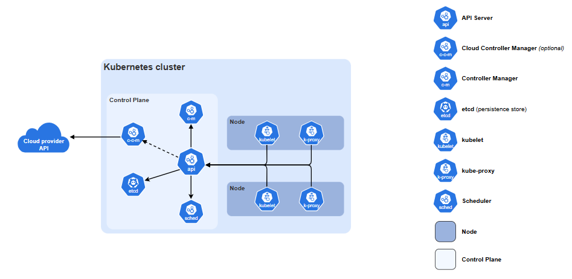

# Control Plane and Its Components

---

## 🧠 What is the Control Plane?

The **Control Plane** is the brain of a Kubernetes cluster. It orchestrates and manages the overall state of the cluster, ensuring that applications run as intended and resources are allocated efficiently.

### Key Responsibilities:
- **Scheduling applications** to appropriate nodes.
- **Responding to cluster events**, such as a node failure.
- **Managing desired state** of applications (e.g., ensuring 3 replicas of a pod are always running).

### 🧩 Components of the Control Plane

The Control Plane consists of several critical components, each with a specific role:

| Component                | Description                                                                 |
|--------------------------|-----------------------------------------------------------------------------|
| **Kube-apiserver**       | Acts as the front-end for the Kubernetes control plane. It exposes the Kubernetes API and is the central point of communication for all components. |
| **Etcd**                 | A consistent and highly available key-value store used to store all cluster data, including configuration and state. |
| **Kube-scheduler**       | Assigns newly created pods to nodes based on resource availability and other scheduling policies. |
| **Kube-controller-manager** | Runs controller processes that regulate the state of the cluster (e.g., replication controller, node controller). |
| **Cloud-controller-manager** | Integrates with cloud provider APIs to manage cloud-specific resources like load balancers, storage, and networking. |

### ✈️ Visual Analogy

Imagine a **traffic/control tower at an airport**:
- The **Control Plane** is the tower.
- The **Nodes** (where your apps run) are the airplanes.
- The Control Plane tells the planes where to go, when to take off, and ensures everything runs smoothly.

### 🔄 Master Node vs Control Plane

Kubernetes terminology has evolved to be more inclusive and precise. Here's a comparison:

| Terminology       | Description                                                                 |
|-------------------|-----------------------------------------------------------------------------|
| **Older: Master Node** | Referred to the node(s) running the control plane components like kube-apiserver, etcd, kube-scheduler, and controller-manager. |
| **Modern: Control Plane** | Preferred term in Kubernetes. Represents the set of components managing the cluster. Can run on one or more nodes, especially in high-availability setups. |

---
## Control Plan Component

### 🧭 Kube-apiserver

The **kube-apiserver** is the front-end of the control plane and exposes the Kubernetes API over HTTP. It is the central hub through which all operations on the cluster are performed. It means:
 - All operation on the cluster go through kube-api server.
 - Kubectl, all component, client libraries (any java implementation) talks to kube-api server.

#### 🔧 Responsibilities:
- **Handles RESTful API requests** from kubectl, other components, and client libraries (e.g., Java clients).
- **Validates and processes requests**: It checks if the request is valid (e.g. correct syntax, permisions) and then processes it.
- **Stores state in etcd**: Interacts with etcd to persist and retrieve cluster state.
  - etcd: It is a key-value store that holds the entire cluster state.
- **Serves as a communication hub**: Enables control plane components like the scheduler, controller manager, and nodes to communicate with API server and to stay updated.

#### 📟 Example: What happens when you run `kubectl get pods`
1. `kubectl` sends a request to the kube-apiserver.
2. The API server authenticates and authorizes the request.
3. It queries etcd for the current state of pods.
4. The result is returned to `kubectl`.

---

### 📦 Scheduling Applications

In Kubernetes, **scheduling applications** means deciding which node in the clujster should run a new pod (the smallest deployable unit of an application).

#### 🔍 What Does Scheduling Involve?
When you deploy an application (e.g., a web server or database), Kubernetes must:
- **Find a suitable node** with enough resources (CPU, memory).
- **Match constraints** like node labels and affinity rules.
- **Place the pod** on the selected node.

This process is handled by the **kube-scheduler**, a key component of the Control Plane.

#### 🧪 Example Scenario
Imagine you have 3 nodes:
- **Node A**: 50% CPU used  
- **Node B**: 70% CPU used  
- **Node C**: 30% CPU used  

The scheduler evaluates these nodes and selects the most appropriate one based on multiple factors.

#### 📊 Factors the Scheduler Considers
- **Resource availability** (CPU, memory)
- **Node limits and tolerations**
- **Affinity/anti-affinity rules** (e.g., run pods together or apart)
- **Pod priority and preemption**
- **Custom scheduling policies**

---

### 🗄️ Etcd

**etcd** is a distributed key-value store that acts as the single source of truth for the entire Kubernetes cluster.

#### 📘 What is etcd?
- A **highly available**, **consistent**, and **distributed** database.
- It stores all cluster data, including:
  - Node information
  - Pod states
  - ConfigMaps
  - Secrets
  - Service discovery data

#### 🚨 Why is etcd Important?
- It ensures **consistency across the cluster**.
- If etcd goes down or becomes corrupted, the **entire cluster state is lost** unless you have a backup.
- All Kubernetes components (like kube-apiserver) **read from and write to etcd**.

#### 🔄 How It Works in the Cluster
- **kube-apiserver** is the **only component** that directly communicates with etcd.
- When you **create or modify a resource** (like a pod), the API server writes the change to etcd.
- Other components (like the scheduler or controller manager) need to know the current state, they **read from the API server**, which in turn reads from etcd.

#### 📟 Example: What happens when you run  
`kubectl create deployment nginx --image=nginx`
1. `kubectl` sends the request to **kube-apiserver**  
2. **kube-apiserver** validates and stores the deployment object in **etcd**  
3. Other components (like the scheduler) schedule the pod based on the data stored in **etcd**

---
## 📌 Additional Insights

Here are a few more important concepts to reinforce your understanding:

- **Declarative Configuration**: Kubernetes uses a declarative model where you define the desired state, and the control plane works continuously to maintain it.
- **High Availability**: In production environments, control plane components are often replicated across multiple nodes to ensure fault tolerance.
- **Security**: The kube-apiserver is the gatekeeper for all cluster operations. Authentication, authorization, and admission control are enforced here.
- **Cluster State Management**: Etcd is critical—if it fails or becomes inconsistent, the entire cluster's state can be compromised.

